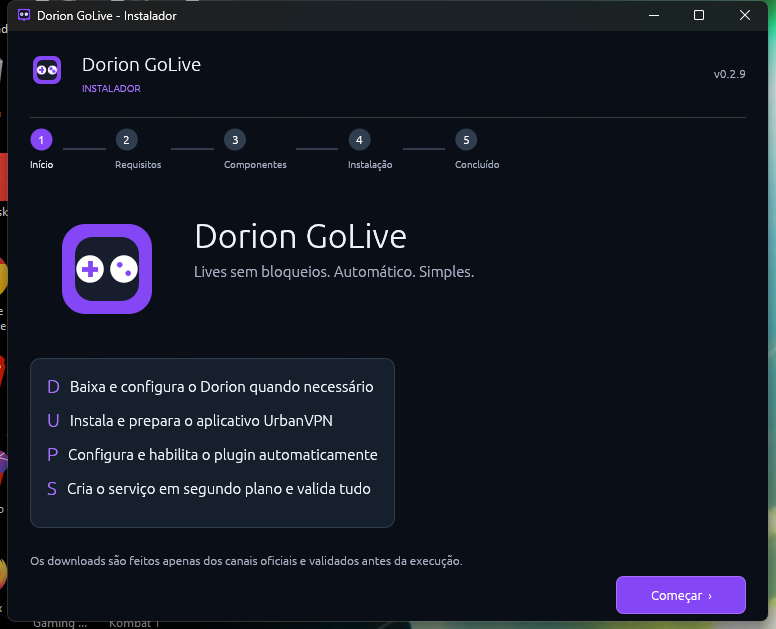

# Dorion GoLive

Aplicativo para Windows que automatiza o uso temporário do UrbanVPN durante a
negociação de transmissões no Dorion. A VPN é confirmada antes de o Dorion
receber a ação de assistir ou transmitir e é desligada depois que a mídia está
realmente ativa.

> Este projeto é independente e não é afiliado ao Discord, Dorion ou UrbanVPN.
> Use-o somente onde o uso desses serviços e de VPN seja permitido.

## Requisitos

- Windows 10 ou 11 de 64 bits;
- conexão com a internet durante a instalação.

O instalador verifica o [Dorion para Windows](https://github.com/SpikeHD/Dorion/releases)
e o [UrbanVPN para Windows](https://www.urban-vpn.com/free-products/free-windows-vpn/).
Quando algum estiver ausente, o assistente mostra o que encontrou, baixa do
canal oficial, valida o arquivo, acompanha a instalação e redetecta o programa
no disco. A conclusão só é exibida depois que Dorion, UrbanVPN, plugin e serviço
forem confirmados. Na primeira utilização, o UrbanVPN ainda pode apresentar uma
tela própria de configuração ou termos. A extensão de navegador não substitui
o aplicativo UrbanVPN para Windows.

Veja a lista separada em [REQUISITOS.md](REQUISITOS.md), incluindo a diferença
entre os requisitos de uso e os de compilação.

## Instalação



1. Baixe `DorionGoLive-Setup.exe` na release.
2. Abra o executável e avance pela verificação de requisitos.
3. Confira os componentes encontrados e os que serão instalados.
4. Aceite o UAC do Windows se um requisito precisar de permissão elevada.
5. Aguarde a confirmação final antes de abrir o Dorion.

O assistente diferencia claramente **já instalado**, **será instalado**,
**baixando**, **validando**, **instalando** e **concluído**. Reexecutar o setup
faz uma nova detecção e funciona também como reparo do plugin e do serviço.

O instalador copia o programa para `%LOCALAPPDATA%\DorionGoLive`, instala e
habilita o plugin em `%USERPROFILE%\dorion\plugins`, adiciona o serviço ao
autostart do usuário, registra a desinstalação no Windows e inicia o monitor
local.

Para remover, abra **Configurações > Aplicativos > Aplicativos instalados >
Dorion GoLive > Desinstalar**. O Dorion GoLive não desinstala o Dorion nem o
UrbanVPN.

### Verificações dos downloads

- Dorion: a API oficial do GitHub fornece dinamicamente o instalador x64 e seu
  SHA-256. O arquivo só é executado quando o hash corresponde.
- UrbanVPN: o download usa `https://install.urban-vpn.com/UrbanVPN.exe`; o
  arquivo só é executado quando o Windows confirma uma assinatura válida de
  **Urban Cyber Security Inc.**
- Todas as URLs precisam usar HTTPS e arquivos temporários são apagados ao
  terminar.

## Como funciona

- Ao detectar uma abertura normal do Dorion, o serviço conecta o UrbanVPN,
  confirma o adaptador de rede, reabre o Dorion pelo atalho original e desliga
  a VPN após a inicialização ficar estável.
- Em **Assistir à transmissão** e no botão contextual do olho, a ação fica
  bloqueada até a confirmação real da VPN. O plugin então executa a ação uma
  única vez e aguarda quadros de vídeo em avanço antes de liberar a VPN.
- Ao compartilhar uma tela, a escolha da janela/tela acontece primeiro. Depois
  da escolha, a captura fica retida até a VPN conectar. A VPN só é desligada
  quando o Dorion confirma o estado nativo de transmissão.
- Cancelamentos e prazos de segurança encerram somente uma conexão iniciada
  pelo próprio Dorion GoLive. Uma ação mais antiga não pode desligar a VPN de
  uma ação mais recente.

Durante o curto período conectado, a VPN é do sistema: outros programas também
podem usar a rota do UrbanVPN. A VPN não é mantida durante a transmissão.

## Diagnóstico

Em um PowerShell novo:

```powershell
dorion-golive status
Get-Content "$env:LOCALAPPDATA\DorionGoLive\dorion-golive.log" -Tail 100
```

O log é limitado a 512 KiB e não registra mensagens, credenciais, áudio, vídeo
ou tokens do Discord. Consulte [Solução de problemas](docs/TROUBLESHOOTING.md)
para as verificações completas.

## Compilar do código-fonte

O código que compõe o produto está em `src`:

- `src/*.rs`: serviço, instalação e controle local;
- `src/dorion-plugin/DorionGoLive.js`: integração com a interface do Dorion;
- `src/urban-ipc`: auxiliar C++ que conversa com o serviço local do UrbanVPN.

Dependências de desenvolvimento:

- Rust estável com target MSVC para x86-64;
- Visual Studio Build Tools 2022 com C++ e Windows SDK;
- CMake 3.24 ou posterior;
- Qt 6.8 com Core, Network e RemoteObjects;
- Node.js 20 ou posterior para testar o plugin.

```powershell
$QtRoot = 'C:\Qt\6.8.3\msvc2022_64' # ajuste para a versão Qt 6.8 instalada
cmake -S src\urban-ipc -B target\urban-ipc -A x64 -DCMAKE_PREFIX_PATH="$QtRoot"
cmake --build target\urban-ipc --config Release
Copy-Item target\urban-ipc\bin\urban-ipc.exe src\urban-ipc\urban-ipc.exe
node --test tests\dorion-plugin.test.mjs
cargo test --locked
cargo build --release --locked
```

O executável `src/urban-ipc/urban-ipc.exe` é gerado antes do build Rust e fica
embutido em `dorion-golive.exe`. Ele é ignorado pelo Git; a automação do GitHub
o recompila a partir do C++.

O fluxo entre esses componentes está detalhado em
[Arquitetura](docs/ARCHITECTURE.md).

## Publicação

O workflow valida formatação, testes e Clippy em alterações normais. Uma tag
`vX.Y.Z`, igual à versão do `Cargo.toml`, também gera:

- `DorionGoLive-Setup.exe`;
- `SHA256SUMS.txt`;
- atestado de procedência do GitHub Actions.

Antes de criar uma tag, confira [RELEASING.md](docs/RELEASING.md). O executável
do Dorion GoLive não possui assinatura Authenticode. O SmartScreen pode exibir
um aviso de reputação e o Controle Inteligente de Aplicativos pode bloquear o
arquivo por completo. A interface do instalador não altera isso: uma futura
assinatura de código confiável é necessária para evitar esse bloqueio.

## Licença

[MIT](LICENSE). Leia também [SECURITY.md](SECURITY.md).
